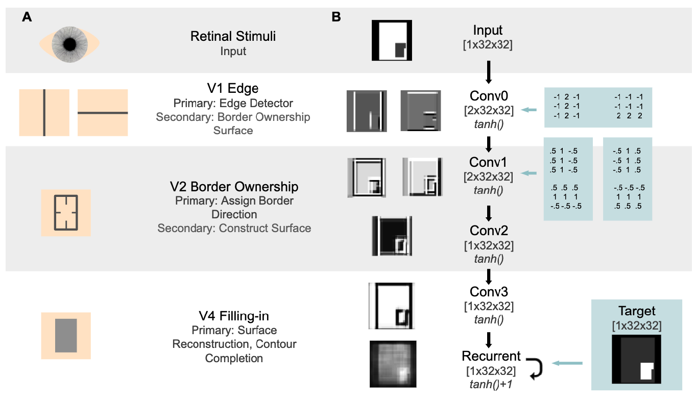
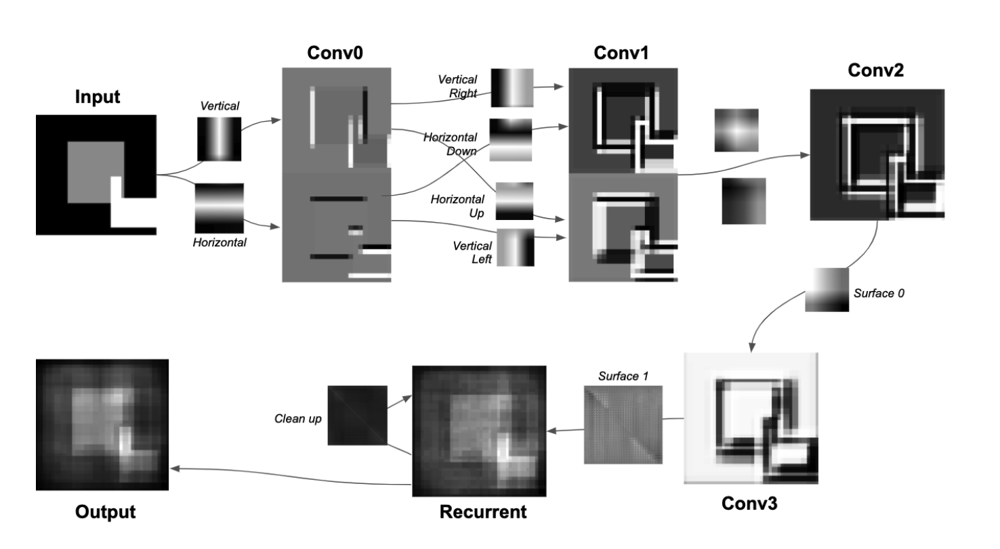

# kanizsa_illusion
A neural computation model to mimic Kanizsa Illusion.

I loved to explore those optical illusions when I was a child. As I'm always curious about the underlying mechanism, I decided to build an agent to simulate the illusory effect.

Here are some images about the model structure:

